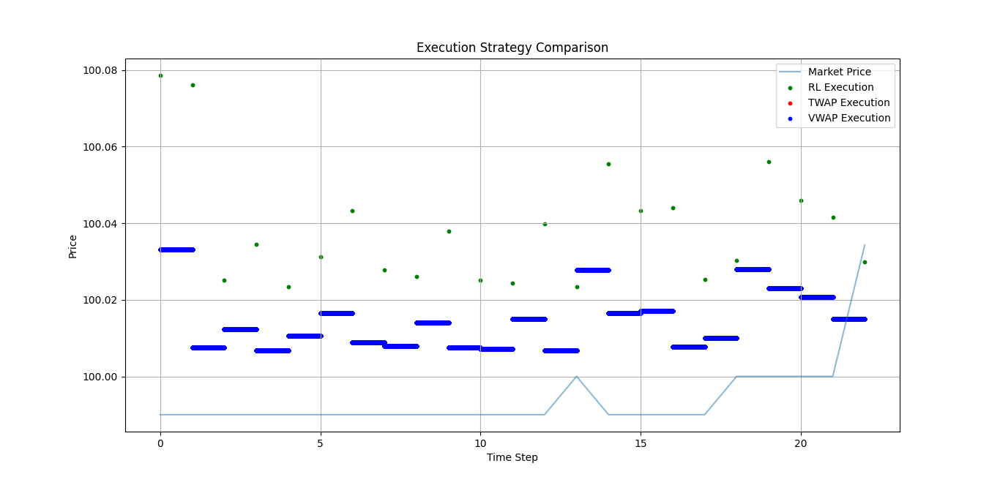

# Reinforcement Learning for Optimal Trade Execution

  

## Table of Contents
- [Project Overview](#-project-overview)
- [Key Features](#-key-features)
- [Installation](#-installation)
- [Usage](#-usage)
- [Results](#-results)
- [Directory Structure](#-directory-structure)
- [Contributing](#-contributing)
- [License](#-license)
- [Contact](#-contact)

## Project Overview
This project implements a Reinforcement Learning agent that learns optimal trade execution strategies by:
- Minimizing market impact and slippage
- Outperforming traditional execution benchmarks (TWAP/VWAP)
- Adapting to different market conditions

**Core Technologies**:
- Python 3.11
- Stable Baselines3 (PPO algorithm)
- Gymnasium for custom RL environment
- Pandas for data processing
- Matplotlib for visualization

## Key Features
- **Custom RL Environment** simulating real market conditions
- **Multiple Benchmark Strategies** (TWAP, VWAP, Random)
- **Advanced Reward Engineering**:
  ```python
  def calculate_reward(self, execution_price):
      benchmark_price = self.get_vwap()
      slippage = execution_price - benchmark_price
      return -slippage * self.order_size  # Penalize slippage
  ```
- **Comprehensive Evaluation Metrics**:
  - Price improvement over benchmarks
  - Reward convergence
  - Execution volatility

## Installation
1. **Clone repository**:
   ```bash
   git clone https://github.com/Smiti02/trade_execution_rl.git
   cd trade_execution_rl
   ```

2. **Set up virtual environment**:
   ```bash
   python -m venv venv
   source venv/bin/activate  # Linux/Mac
   venv\Scripts\activate     # Windows
   ```

3. **Install dependencies**:
   ```bash
   pip install -r requirements.txt
   ```

## Usage
### Training the Agent
```bash
python train.py \
    --algorithm PPO \
    --total_timesteps 100000 \
    --save_path models/ppo_trade_execution
```

### Evaluating Performance
```bash
python evaluate.py \
    --model models/ppo_trade_execution.zip \
    --episodes 100 \
    --render  # Shows live visualization
```

## Results
### Sample Output
| Metric               | RL Agent | TWAP   | VWAP   | Random |
|----------------------|----------|--------|--------|--------|
| Avg. Execution Price | 100.04   | 100.01 | 100.01 | 100.08 |
| Price Improvement    | -0.02%   | 0%     | -0.02% | -0.07% |
| Reward (Cumulative)  | -1333.11 | -      | -      | -4215.32|


## Directory Structure
```
trade_execution_rl/
├── agents/               # RL algorithm implementations
├── envs/                 # Custom Gym environments
├── models/               # Saved model checkpoints
├── results/              # Evaluation outputs and visualizations
├── data/                 # Market data files
├── train.py              # Training script
├── evaluate.py           # Evaluation script
├── requirements.txt      # Dependencies
└── README.md             # This file
```

## Contributing
We welcome contributions! Please follow these steps:
1. Fork the repository
2. Create your feature branch (`git checkout -b feature/improvement`)
3. Commit your changes (`git commit -m 'Add new feature'`)
4. Push to the branch (`git push origin feature/improvement`)
5. Open a Pull Request

## License
MIT License - See [LICENSE](LICENSE) for details.

## Contact
For questions or collaborations:
- **Smitirani Haripal** 
- GitHub: [Smiti02](https://github.com/Smiti02)
- Email: smitiraniharipal@gmail.com
- LinkedIn: https://www.linkedin.com/in/smitirani-haripal-18a331282/
